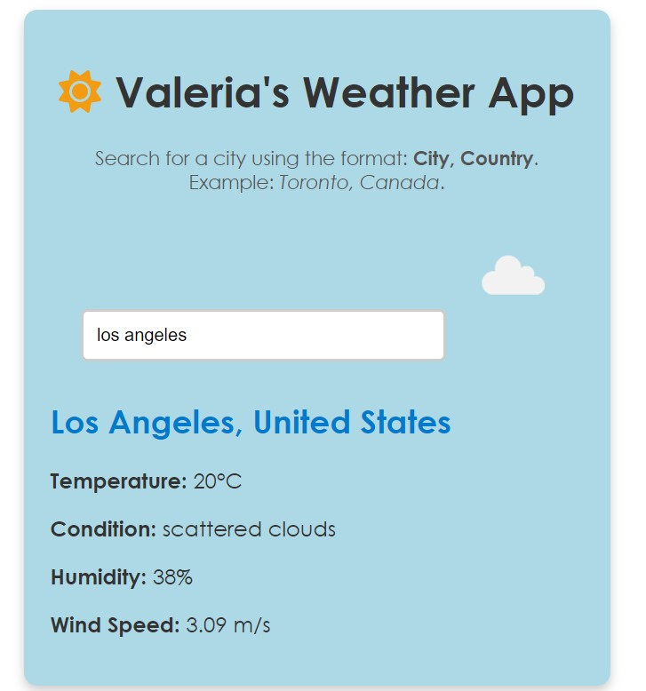
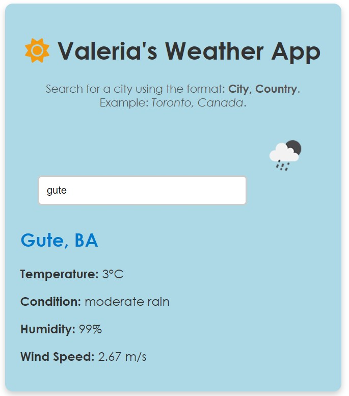
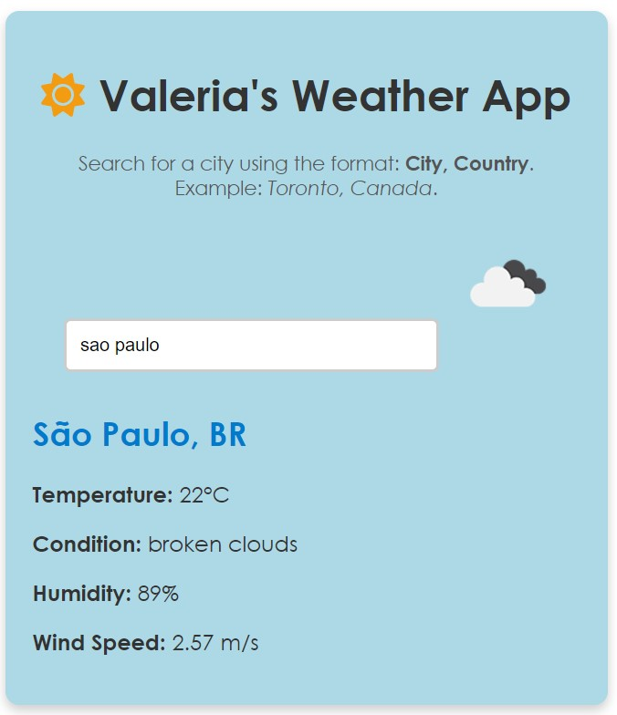

# Valeria's Weather App

Valeria's Weather App is a modern React application that allows users to view real-time weather conditions for any city in the world. The app fetches data from the OpenWeatherMap API and displays essential weather details like temperature, humidity, wind speed, and a dynamic weather icon representing the current condition.

---

## Features
- **Dynamic Weather Data**: Fetches and displays real-time weather data for any city.
- **Visual Weather Icons**: Icons dynamically represent weather conditions (sunny, rainy, cloudy, etc.).
- **Default Location**: Automatically reverts to Toronto, Canada, when no input is provided.
- **User-Friendly Input**: Guides users to input the city and country (e.g., "Los Angeles, United States").
- **Responsive Design**: A visually clean and intuitive layout for any device size.

---

## Weather Examples

### 1. **Sunny Weather**
- **Description**: A clear and sunny day with no cloud coverage.
- **Example Location**: Los Angeles, United States.
- **Screenshot**:  
  

---

### 2. **Rainy Weather**
- **Description**: Rainfall, including light rain, drizzle, or heavy showers.
- **Example Location**: Cubatão, Brazil.
- **Screenshot**:  
  

---

### 3. **Cloudy Weather**
- **Description**: Overcast skies with significant cloud coverage.
- **Example Location**: São Paulo, Brazil.
- **Screenshot**:  
  

---

## How to Use
1. Open the application in a web browser.
2. Enter a city and country in the input field (e.g., `Buenos Aires, Argentina`).
3. The app fetches and displays the following details:
   - **Temperature**: Displayed in degrees Celsius.
   - **Humidity**: Percentage of moisture in the air.
   - **Wind Speed**: Speed of the wind in meters per second.
   - **Weather Icon**: A dynamic icon representing the current weather.
4. Clear the input field to revert to the default location (Toronto, Canada).

---

## Technologies Used
- **React.js**: For building the interactive user interface.
- **Axios**: To handle API requests.
- **OpenWeatherMap API**: For fetching real-time weather data.
- **Font Awesome**: For the sun icon in the header.
- **CSS**: For styling the application and ensuring responsiveness.

---

## How to Run the Project Locally
1. Clone the repository:
   ```bash
   git clone https://github.com/v-aap/123456789_comp3123_labtest2.git
